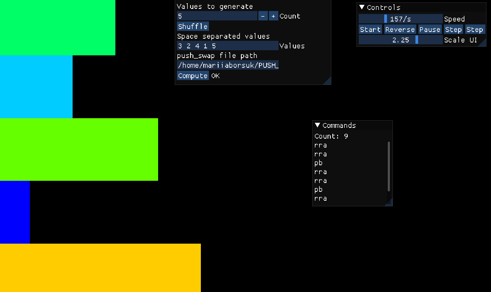
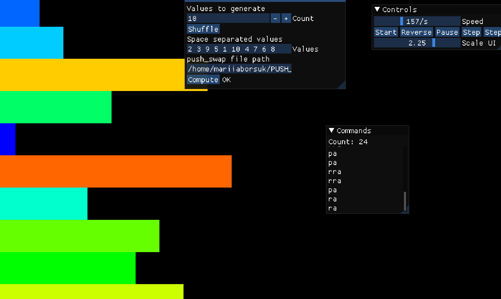
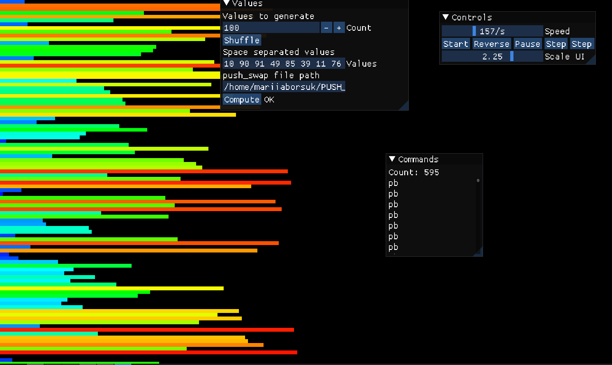
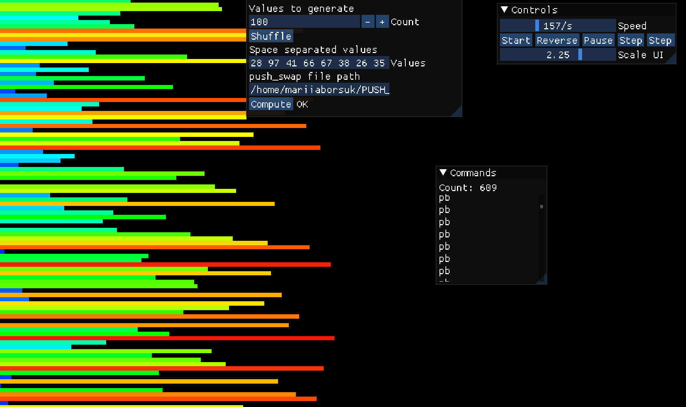
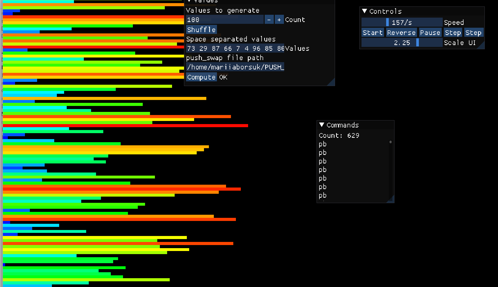
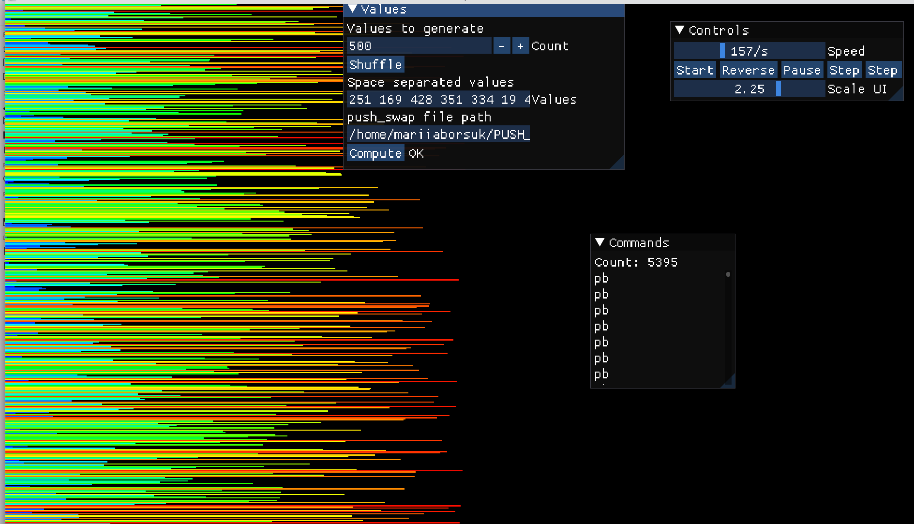
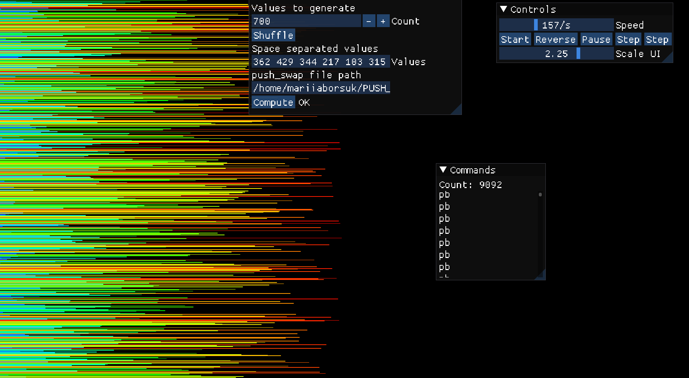

# push_swap

push_swap is a 42 project about sorting. You get a list of integers in stack A and an empty stack B, and you have to sort stack A using only a small set of operations. The fewer operations, the better.

## How to run

```bash
git clone https://github.com/<your-username>/push_swap.git
cd push_swap
make
```

Then pass the numbers as arguments:

```bash
./push_swap 42 0 67 -3 100 21 -17
```

or as one string:

```bash
./push_swap "42 0 67 -3 100 21 -17"
```

The first number is the top of the stack. The program prints the operations, one per line. With no arguments it prints nothing.

Other Makefile rules: `make clean`, `make fclean`, `make re`.

## Operations

| Operation | What it does |
|-----------|--------------|
| `sa` | swap the first two elements of A |
| `sb` | swap the first two elements of B |
| `ss` | `sa` and `sb` at the same time |
| `pa` | take the top of B and put it on top of A |
| `pb` | take the top of A and put it on top of B |
| `ra` | rotate A up, the first element becomes the last |
| `rb` | rotate B up, the first element becomes the last |
| `rr` | `ra` and `rb` at the same time |
| `rra` | rotate A down, the last element becomes the first |
| `rrb` | rotate B down, the last element becomes the first |
| `rrr` | `rra` and `rrb` at the same time |

## Errors

The program prints `Error` if an argument is not an integer, if a number is bigger than `INT_MAX` or smaller than `INT_MIN`, or if there are duplicates.

## My struct

Both stacks are doubly linked lists made of these nodes:

```c
typedef struct t_node
{
	int				value;
	int				current_position;  // index in the stack, 0 is the top
	int				push_price;        // how many moves to bring it and its target to the top
	bool			above_medium;      // true if the node is in the upper half
	bool			cheapest;          // true for the cheapest node in B
	struct t_node	*target_node;      // where this node should go in A
	struct t_node	*next;
	struct t_node	*prev;
}					t_node;
```

## Algorithm

I used the Turk algorithm. The idea is to move everything to stack B and then bring the numbers back to A one by one, always choosing the one that costs the fewest moves.

1. If the numbers are given as a string (`"1 2 4 5"`), split it. Otherwise use the arguments as they are.
2. Validate the input and check for duplicates.
3. Create two linked lists, A and B. A gets the numbers, B is empty.
4. Lists with 2, 3 or up to 5 numbers are sorted separately.
5. With more than 5 numbers, push everything to B until only 3 numbers are left in A.
6. Sort the 3 numbers left in A.
7. For every node in A and B, check if it is in the first or the second half of its stack.
8. For every node in B, find its target node in A. This is the smallest number in A that is bigger than the node.
9. If no number in A is bigger, the target node is the smallest number in A.
10. Count the moves (`push_price`) needed to get each node in B and its target in A to the top of their stacks.
11. Find the cheapest node in B.
12. If the cheapest node and its target are both in the first half, rotate both with `rr`. If both are in the second half, use `rrr`. If they are in different halves, rotate each stack on its own. When one of them is already on top, the other one keeps rotating alone.
13. Push the node to A with `pa`, then reset `above_medium`, `target_node`, `push_price` and `cheapest`. Repeat from step 7 until B is empty. At the end, rotate A until the smallest number is on top.

## Testing

With the checker from the 42 intra:

```bash
ARG="4 67 3 87 23"; ./push_swap $ARG | ./checker_linux $ARG
```

It prints `OK` if the stack is sorted and `KO` if not.

To count the moves:

```bash
ARG="4 67 3 87 23"; ./push_swap $ARG | wc -l
```

For random numbers:

```bash
ARG=$(shuf -i 0-1000 -n 100 | tr '\n' ' ')
./push_swap $ARG | ./checker_linux $ARG
./push_swap $ARG | wc -l
```

`2 1 0` should take 2 or 3 moves and `1 5 2 4 3` should take 12 or less.

Memory leaks:

```bash
valgrind --leak-check=full ./push_swap 3 2 1
```

## Visualizer

I tested my push_swap with [push_swap_visualizer](https://github.com/o-reo/push_swap_visualizer) by [o-reo](https://github.com/o-reo). Each bar is a number, and "Count" in the Commands window is the number of moves.

5 numbers (9 moves) and 10 numbers (24 moves):

 

100 numbers (595, 609 and 629 moves, the limit for full points is 700):

  

500 numbers (5395 moves, the limit for full points is 5500):



And 700 numbers just to try (9092 moves):



## Author

Mariia Borsuk
